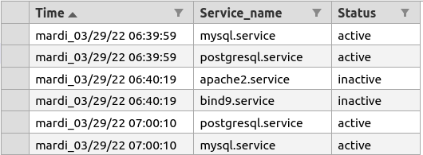

# Check Services on Linux Server 🌐🖥

Check if some services are <b>started</b> and <b>Restart</b> them if not. <br/>
Show Alert message, if <b>after 4 missed restart</b>.



## About files

<ul>
    <li> <b>service_check.sh</b> is the script to be launch with root privileges.
    <li> <b>services.txt</b> contains services to check.
    <li> <b>log.csv</b> contains feedbacks about services.
</ul>

## How to use ?

```
sudo sh service_check.sh services.txt >> log.csv
```

